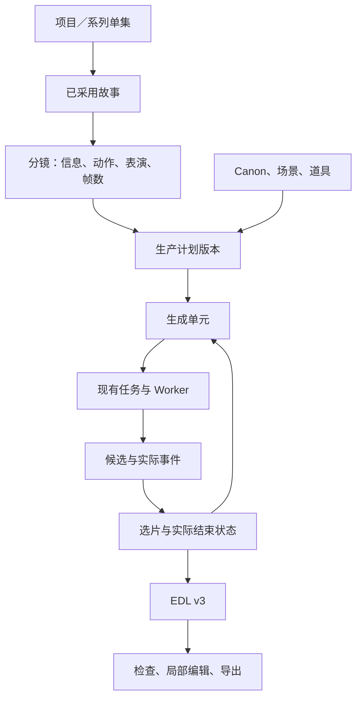

# CatFlow 剧情分镜、一致性与长短片统一生产改造方案

编制日期：2026-09-19。状态：代码主体已落地，故事已导入，未完成统一验收。

> **最新执行范围（2026-09-19）**：用户要求停止追加回归／专项测试，并取消由助手执行真实链路验证，仅导入故事，后续由用户自行触发。15 秒和 45 秒故事已创建并采用。视频任务提交数为 0，不自动继续生成。此前已提交的故事、图片与导演任务保留。下方保留原设计与验收清单；具体已执行结果见 [实施交付记录](NARRATIVE_PRODUCTION_DELIVERY.md)。

本方案经用户确认：长短片统一改造，按技术依赖分阶段完成；使用 15 秒、45 秒各一条《新软垫与旧纸箱》V4 白猫基准样片。保留灰猫／白猫、整片、逐镜、局部编辑、新建、导入、系列及历史恢复。不使用 Superpowers。

## 目标与固定边界

作品支持 8–60 秒整数目标，24 fps、9:16；新分镜最多 24 镜，每镜 24–360 帧。当前 Ark 视频能力仍为单次 4–15 秒，单元包含连续 1–4 镜且不跨场景。作品时间、镜头取用时间、模型生成时间和实际素材时间分别保存，剪辑使用整数帧。新建默认灰猫，验证显式选择 V4 白猫。

创作围绕一个生活事件，明确角色目标、观众期待、小意外、揭示、回应、回报。猫咪保持自然行为，眼型身份不锁定眼睑和注意目标。重要反应需要可读角度；不依赖机械眨眼或循环动作填时长。无音乐、无对白作为生成要求，实际音轨仍须听查。

不增加任意多角色组合、训练或角色发布系统、三维编辑器、第二工作流数据库，不默认升级模型，不进行无限补生成，不按目录名或 legacy 名称删除历史资料。

## 架构与数据职责

- 故事版本增加可选 narrativeDesign：characterGoal、audienceExpectation、smallDisruption、reveal、response、payoff、adaptationNotes。
- 分镜使用明确的新格式版本；durationFrames 是新格式时长依据，秒数为投影。历史格式仍按原约束读取。
- production_plan_versions 保存分镜、Canon、场景布局、道具绑定、连续镜头分组、依赖和内容哈希的不可变版本。
- production_unit_selections 保存采用候选、每镜取用区间、关键事件、实际状态及证据的版本。
- 任务沿用现有 jobs、幂等、外部回执与恢复生命周期；不重复保存另一套任务状态。
- EDL v3 继续作为剪辑唯一执行依据；系列单集与作品内生成单元分开。

历史缺省字段不补造创意；旧任务、Canon、哈希、提示词、导演结果、EDL 保留原解释。新版本只影响新提交。修改上游使依赖预览失效，已运行任务继续使用冻结输入并标明来源过期。新引用加入资产保护。

## 阶段 0：基线、兼容样本与准备

- [ ] 后端、Vue、类型与构建基线，区分真实失败与旧断言。
- [ ] 核对业务库、迁移 head，保存并验证可恢复备份。
- [ ] 覆盖旧分镜、表演分镜、冻结任务、EDL v1/v2/v3 与风车实片记录。
- [ ] 清点表单、Schema、数据库、Worker、剪辑各层时长限制。
- [ ] 清理逐项记录删除／合并／归档／保留及调用证据。

保留历史恢复代码；媒体删除须证明所有引用均不存在。错误处理、日志、重试或恢复行为变化必须明示。

## 阶段 1：统一契约与生产计划

- [ ] 创建、修改、导入、系列与重制支持 8、12、15、30、45、60 秒。
- [ ] 新分镜 24 镜、单镜 24–360 帧、总帧数闭合；旧格式仍为 8–15 秒和最多 4 镜。
- [ ] 生产计划版本、来源、激活与乐观并发校验。
- [ ] runtime/bootstrap 返回作品、镜头、模型时长与参考额度。
- [ ] 页面显示作品长度与预计单元数，共用工作区。

较长作品调用旧整片入口必须明确拒绝，不能截断。数据库迁移不自动转换旧记录、不创建模型任务。OpenAPI、生成 TS、手写类型与 Worker 同步。

## 阶段 2：叙事、信息与表演

- [ ] narrativeDesign 随提案采用、故事版本和来源绑定保存；改编说明保留新增互动，原文不改写。
- [ ] 每镜信息职责：建立／行动／反应／揭示／回报／衔接；新增信息、可见主体、故事映射与关键事件。
- [ ] 单角色及纯道具镜头；不在画面角色不强制走位或动作。
- [ ] actionBeats 继续作为动作顺序来源；角色动作皆空时须有明确道具／环境变化。
- [ ] 策划摘要、分镜编辑、关键事件和本地缩略图定时预演。

验收：长故事不每 15 秒重新收尾；修改事件使相关预览失效；预演不触发付费调用。

## 阶段 3：道具、布局与真实参考

- [ ] 关键道具：稳定 ID、图片、识别特征、状态、归属、位置、使用镜头。
- [ ] 场景：环境资产、区域、家具、支撑面、起点、机位、朝向、轴线；表单和二维示意。
- [ ] 系列共享登记解析成生产计划资产快照；关键道具缺图明确阻塞。
- [ ] 普通参考与严格首帧分别装配；显示直接提交与上游首帧来源。
- [ ] 参考超额阻塞并列明原因，不静默丢图；同图多职责保留映射。
- [ ] 不提交辅助三视图、无关道具，不强制画外角色入画。

验收：登记 → 预览 → 冻结 → Mock Ark 的实际 ID/哈希一致；资产变更只使使用者失效。

## 阶段 4：生成单元、编译与连续性

- [ ] 本地顺序分组：遇场景变化、超时、超过 4 镜、参考超额或显式独立镜头则拆分；可编辑合并／拆分。
- [ ] 模型时长向上取合法值，最短 4 秒；不要求表演填补取用外时长。
- [ ] 承接实际状态／独立建立起点两种关系；后者记录省略或重建理由。
- [ ] 实际状态记录角色位置姿态、道具归属状态、未完成动作、结束帧证据与不确定项。
- [ ] 关键状态未确认时阻塞依赖提交，结束帧不强行充当换机位首帧。
- [ ] 编译顺序：事件结果、起点空间、时间动作、固定身份道具声音、具体排除。
- [ ] 约 2500 中文字符仅作长度提醒，不截断；展示分段字数。
- [ ] 整片／单镜／分组共享实质业务逻辑；旧接口保留兼容。

提交在事务内核对 Canon、计划、单元、参考与上游选片；同键同输入重放，同键异输入冲突。运行／提交未知任务阻止重复付费。失败不自动重抽；未知先查询恢复；本地结构修复保留原文及差异。

## 阶段 5：选片、剪辑、事件验收

- [ ] 候选历史保留，当前采用版本明确；记录来源任务、设计哈希、取用、事件与实际状态。
- [ ] 一候选可供多镜，区间按序、不重叠、不越界，取用帧数闭合。
- [ ] 只调整内部剪辑分配且生成语义、单元总长不变时可复用素材并重新确认。
- [ ] EDL v3 组装 8–60 秒，默认硬切；无自动变速、补帧、循环填充。
- [ ] 记录来源实际尺寸与 720×1280 导出缩放，不宣称原生高清。
- [ ] 分段原声、静音、候选／当前音轨；沿用包络，声音听查。
- [ ] 关键事件映射素材／镜头／成片帧区间；原速、0.5×、0.25×、逐帧与事件跳转。
- [ ] 检查分为通过、有差异、未达到、无法判断、不适用；AI 诊断仅可选建议。
- [ ] 长作品局部编辑仍受模型短上下文限制，选区外不变。

严重身份、肢体、道具或反转缺失不能标成内容通过；带问题候选仍可保留和导出。技术通过与内容通过分开。

## 阶段 6：测试、基准样片、交付

测试覆盖：时长范围、所有创建入口、两套 Canon、新旧分镜与哈希、道具和引用额度、分组与依赖、并发、幂等、未知提交恢复、多镜选片、素材不足、实际帧率、360/1080/1440 帧 FFmpeg 组装、声音、长片短选区编辑、Vue 保存恢复与事件跳转、OpenAPI 与 Worker 一致性。功能测试不调用付费模型。

样片：《新软垫与旧纸箱》。儿童给白猫准备软垫，白猫选择纸箱，儿童理解并把纸箱挪到身旁。允许切镜省略钻箱，不以复杂接触动作作为硬要求。

| 样片 | 时间与内容 | 生成安排 |
|---|---|---|
| 15 秒 | 0–3 铺垫；3–6 注意转移；6–10 揭示纸箱；10–15 回应陪伴 | 4 镜，1 单元 |
| 45 秒 | 0–15 准备与邀请；15–30 尝试、调整与转向；30–45 揭示与回应 | 9 镜，3 单元 |

真实提交前保存请求清单。上限：故事 2 次、导演 2 次、视频 4 次、图片最多 3 次（软垫、纸箱、共享无人场景各一次，可复用则减少）、AI 审片 0、默认补生成 0。未知先恢复；本地修复和取帧不算新候选。未达标保留证据，不默认重抽。

每条交付到 `var/exports/narrative-production-baseline/<project-id>/`：MP4、原单元、取用/EDL、模型与任务、参考哈希、媒体规格、事件与声音检查、用量/费用状态、项目页面。未知价格标为未确认。

完成分别判断：工程链路与历史回归通过；两条样片按范围执行并完成检查；内容逐项通过或记录不足。两条样片不证明统计稳定性。

## 接口与上线

新增 project 下 production-plans（列表、创建、preview、activate、assemble）与 production-units/{unitId}（preview、generations、selections）；复用现有故事、分镜、资产、检查、诊断、编辑接口。所有写入沿用 CSRF、幂等、预期版本与哈希。先部署新旧兼容 API/Worker，再迁移、测试、前端统一开放、样片、交付。旧 Worker 不得消费新格式任务。

故障时关闭新提交入口，保留已有任务查询恢复；不得回滚到无法读取新记录的程序。模块按叙事契约、计划依赖、参考解析、编译、选片状态、组装职责组织；遵守约 400 行目标、500 行通常上限，超大旧文件仅提取本轮明确责任，不创建无行为转发层。

## 执行记录

阶段 0 已完成备份、隔离恢复和业务库增量迁移；历史内容摘要保持一致。

阶段 1–5 的主要数据、接口与页面实现已写入工作区，生产构建已部署到本机。包括新叙事与帧级分镜、版本化生产计划、场景／道具绑定、单元编译和依赖、实际状态与选片、EDL v3 组装。详细测试结果及尚未复测的修改见实施交付记录；这些实现不等于所有验收条目已经通过。

阶段 6 按用户最新指示停止追加验证。两版故事和已有准备资料交给用户继续；不生成基准 MP4，也不据此宣称真实长片链路或统计稳定性已通过。
