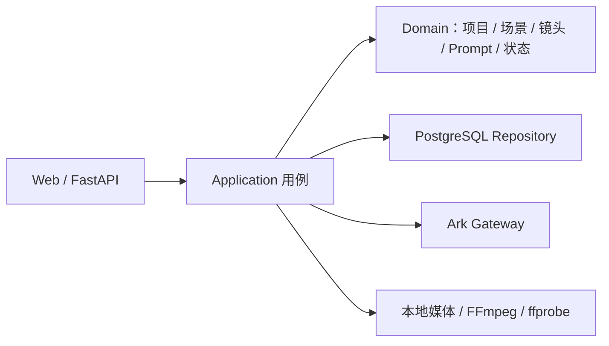

# ADR-001：显式状态机与任意镜头队列

状态：已采用（V4）。

## 决策

系统采用模块化单体、显式 Python 状态机、PostgreSQL、Pydantic、Ark 网关和本地不可变
媒体，不引入 LangGraph、Celery、Redis 或第二套工作流状态源。



## V4 事实模型

```text
StoryProject(title)
└─ Scene(order, title, sourceText, chapterLabel?, contextNote?)
   └─ ShotCard(order, title, direction, durationSeconds, anchorMode, references)
```

删除总导演、自动三集、固定时段、场景路线、Episode、世界状态、强制故事板和长视频
延展。完整镜头描述是创作事实；JSON 只保存排序、8～15 秒时长、锚点方式和用户明确
选择的素材职责。

## 不变量

1. 一张镜头卡对应一个独立视频片段和自己的 attempt 历史。
2. 收费 Step 与实际 Prompt 在一个短事务中创建，之后才调用 Provider。
3. 相同输入复用原 Step；显式重做使用 `attempt+1`，旧证据不可覆盖。
4. `submission_unknown` 禁止再提交，只能按任务列表对账；已有 Task ID 只能查询。
5. 图片和视频均由人工批准；AI 视频抽帧分析只保存建议。
6. 外部图片只在用户指定 usage、role 和目标节点后进入请求。
7. 已批准镜头片段、区间版本和项目总片 Revision 都不可变、可比较、可回退。
8. 区间重拍只在单一镜头内部进行；跨镜头必须拆分或重做镜头。

PostgreSQL保存关系与工作流状态；媒体正文保存到本地资产根并以 SHA-256 审计。Web
JobRegistry只承担进程内展示和并发付费门，不是第二个状态源。
